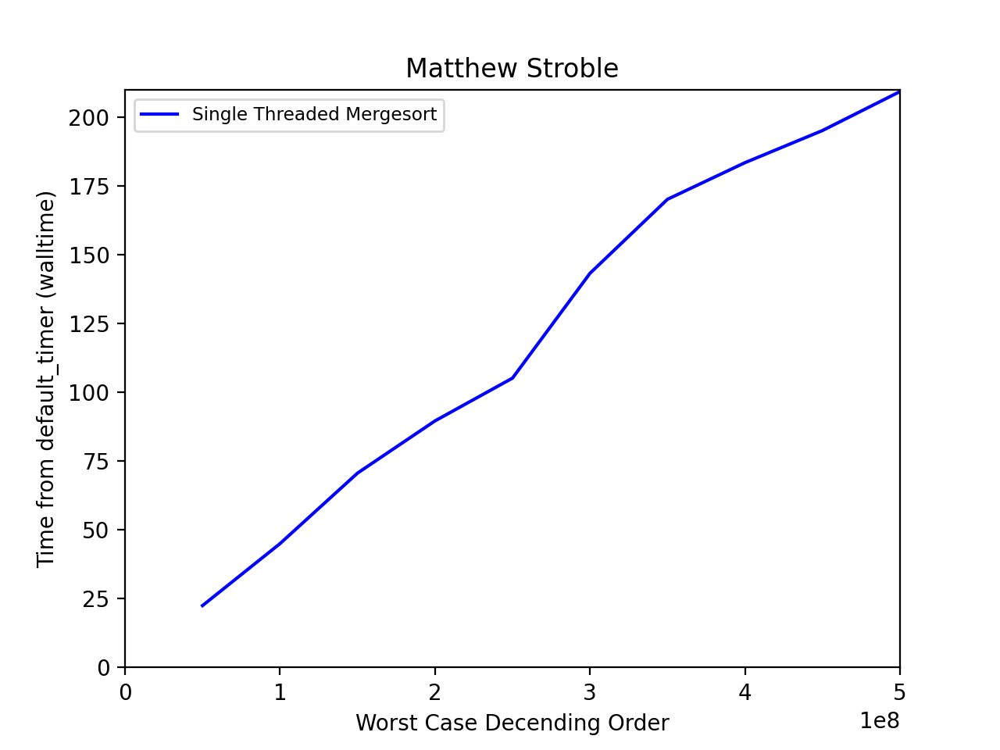
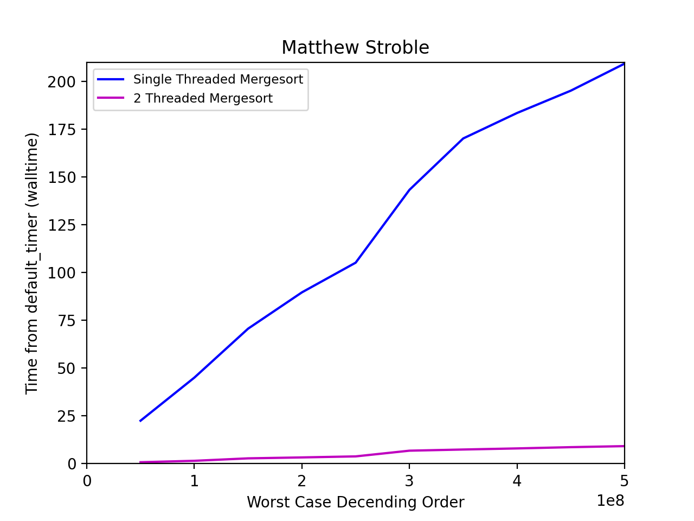
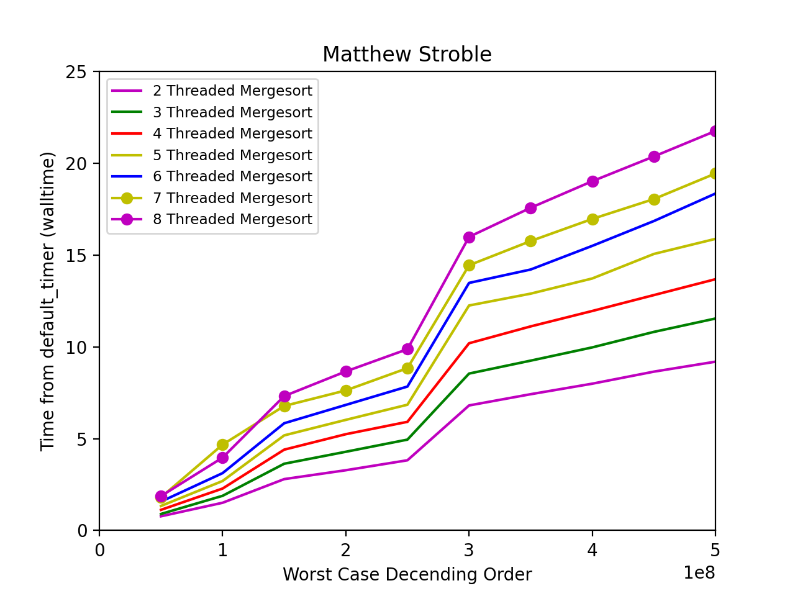

# Parallel Merge Sort Benchmarking
This version of parallel mergesort uses differed asynchronous launching method. The goal of the program is to benchmark the serial version of merge sort and benchmarking the multithreaded version of mergesort ( p_mergeSort() ). 

This testing will be updated periodically to investigate different methods of threading and their performance.

## Results
### Single-Threaded (X axis in 100 million)

### Multi-Threaded (p_mergeSort)(X axis in 100 million)

### Multi-Threaded (p_mergeSort threading from 2 to 8)(X axis in 100 million)

